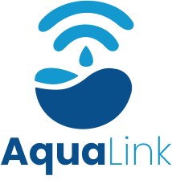

<div align="center">
  
</div>

# AquaLink

**Aqua**Link é uma garrafa inteligente conectada via Bluetooth ao seu celular, capaz de monitorar sua ingestão de água em tempo real.  
O objetivo do projeto é incentivar hábitos mais saudáveis, tornando o acompanhamento da hidratação simples, moderno e acessível.

## Funcionalidades
- Monitoramento em tempo real do consumo de água.  
- Conexão Bluetooth com aplicativo mobile e web.  
- Histórico de hidratação diário e semanal.  
- Lembretes personalizados de hidratação.  
- Interface intuitiva e responsiva no app.  

## Tecnologias Utilizadas

### Frontend: React + TailwindCSS
- **React:** Biblioteca JavaScript para construção de interfaces de usuário reativas e componentizadas.
- **TailwindCSS:** Framework utilitário para estilização rápida e responsiva, facilitando a criação de layouts modernos.
- **shadcn/ui:** Biblioteca de componentes UI acessíveis, modernos e altamente customizáveis, construída sobre Radix UI e TailwindCSS, acelerando o desenvolvimento de interfaces profissionais.
- **Motion:** Biblioteca para animações declarativas e interações fluidas em React, permitindo transições suaves e efeitos visuais avançados com sintaxe simples.

### Backend: 

### Firebase (Banco de dados, autenticação e deploy)
- **Firebase Realtime Database:** Banco de dados NoSQL em tempo real, utilizado para armazenar e sincronizar dados de hidratação dos usuários.
- **Firebase Authentication:** Autenticação de usuários de forma segura, permitindo a integração de contas entre o aplicativo e a página web.
- **Firebase Hosting:** Permite a integração com o repositório do GitHub para facilitar o processo de CI/CD de forma intuitiva.


### Hardware: ESP32 + Sensor Time of Flight
- **ESP32:** Microcontrolador com conectividade Bluetooth, responsável pela coleta dos dados do sensor e envio ao app.

## Estrutura do Projeto
```bash
├── src
│   ├── assets        # Logos, imagens e ícones
│   ├── components    # Componentes reutilizáveis
│   ├── contexts      # Contextos variados
│   ├── css           # Estilização adicional do projeto
│   ├── layouts       # Layouts utilizados nas páginas
│   ├── lib           # Blibliotecas extras
│   ├── pages         # Páginas principais
│   └── App.tsx       # Arquivo principal
```

## Como executar o projeto localmente
Requisitos
- Node.js (recomenda-se a mesma versão usada no projeto, v22.11.0)
- npm (v9+)
- Git

1. Clone o repositório:
    ```bash
    git clone https://github.com/Kirarizinho02/AquaLink.git
    cd IncluMove
    ```
    
2. Instale as dependências:
    ```bash
    npm install
    ```

3. Configure as variáveis de ambiente:
   - As variáveis sensíveis (ex: chaves do Firebase) **não estão no repositório** por segurança.
   - Para rodar localmente, crie um arquivo `.env` na raiz do projeto, para isso, foi disponibilizado o seguinte comando:
  
     ```bash
      npm run make-env-example
     ```
   - Ele criará um arquivo `.env` com placeholders no lugar das variáveis. Então, preencha os valores reais das variáveis (peça a algum responsável pelo projeto ou consulte o painel do Firebase).
    
4. Inicie o programa:
    ```bash
    npm run dev
    ```
    
5. Abra o aplicativo em: [localhost](http://localhost:3000/)

## Links

### Deploy: [Firebase](https://aqualink-tcc.web.app)

## Integrantes

- Gabriel Carniatto — [@gwerta](https://github.com/gwerta)
- Samuel Augusto — [@Kirarizinho02](https://github.com/Kirarizinho02)
- Vitor Eto — [@HidekiEto](https://github.com/HidekiEto)
